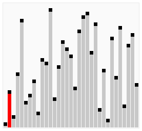

# 🚀 JavaScript: Ejercicios de Fundamentos

Este repositorio contiene una serie de ejercicios prácticos desarrollados para consolidar mis conocimientos en **JavaScript**, abarcando desde los fundamentos básicos hasta la manipulación de objetos y estructuras de control avanzadas.

## 📋 Tabla de Contenidos
1. [Introducción al lenguaje](#1-introducción-al-lenguaje)
2. [Variables y Control de Flujo](#2-variables-y-control-de-flujo)
3. [Arreglos y Algoritmos](#3-arreglos-y-algoritmos)
4. [Funciones Modulares](#4-funciones-modulares)
5. [Objetos y Colecciones](#5-objetos-y-colecciones)

---

## 💻 Descripción de los Módulos

### 1. Introducción al lenguaje
Implementación básica de interacción con el usuario mediante `prompt` y `alert`, incluyendo validaciones de entrada de datos.

### 2. Variables y Control de Flujo
Calculadora funcional que utiliza `switch` para manejar operaciones matemáticas básicas (`+`, `-`, `*`, `/`) con manejo de errores para división por cero.

### 3. Arreglos y Algoritmos
Generación de un arreglo con números aleatorios y aplicación del algoritmo de **Ordenamiento Burbuja (Bubble Sort)** para entender la lógica de manipulación de estructuras de datos.
 <br>

### 4. Funciones Modulares
Práctica sobre la composición de funciones, donde una función principal coordina la ejecución de otras funciones específicas para realizar operaciones matemáticas.

### 5. Objetos y Colecciones
Creación de objetos con métodos propios (`this`) y uso de métodos avanzados de arreglos como `forEach()` (para iteración) y `map()` (para transformación de datos e inmutabilidad).

---

## 🛠️ Tecnologías
* **JavaScript (ES6+)**
* **Node.js** (Entorno de ejecución)

## 🚀 Cómo ejecutar
1. Clona este repositorio:
   ```bash
   git clone [[text](https://github.com/gabboIng/Ejercicios-de-js.git)]